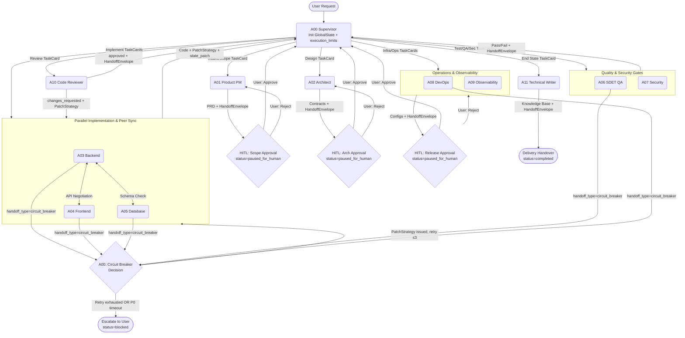

# Full Lifecycle Playbook (State Graph)

## Intent

Provide a deterministic execute-and-route sequence for software delivery across 12 distinct Agents. This document represents the logical **Directed Acyclic Graph (DAG)** of the system, including circuit breaker branches and HITL pause points.

## The DAG Topology

## State Nodes

### Stage 1 — Intake & Constraints (State: `intake` → `scoping`)
- **Nodes**: `A00`, `A01`
- **Edges**: `User → A00 → A01 → HITL1 → A00`
- **Action**: Transform abstract wishes into structured JSON (`prd.schema.json`). A00 initializes `GlobalState` with `trace_id`, `execution_limits`, and `trace_started_at`.
- **Timeout Policy**: A01 is a pure document-generation agent — no CLI execution. No terminal timeout risk. Max reasoning steps: 5.
- **Exit Condition**: A01 yields In-Scope/Out-of-Scope diagram. User explicitly approves via `HITL1` (`status: "paused_for_human"` → User sets `status: "running"`).

### Stage 2 — Architecture Contracts (State: `architecture`)
- **Node**: `A02`
- **Edges**: `A00 → A02 → HITL2 → A00`
- **Action**: Build data models and finalize explicit REST/GraphQL API inputs/outputs (OpenAPI 3.0 spec + Mermaid DB Schema).
- **Timeout Policy**: Pure document-generation; no CLI execution risk. Max reasoning steps: 8.
- **Exit Condition**: A02 yields OpenAPI spec and Mermaid DB Schema with all entity relationships defined. User approves via `HITL2`.

### Stage 3 — Implementation (State: `implementation`)
- **Nodes**: `A03`, `A04`, `A05`
- **Edges**: `A00 → Subgraph_Impl → A00` (inner: `A03 ↔ A04 ↔ A05`)
- **Action**: Parallel coding. Sub-graph allows A04 to negotiate undocumented APIs with A03 directly without A00 escalation. All terminal commands use non-interactive flags and explicit timeout budgets (see `mappings/skills-map.yaml` → `timeout_budgets`).
- **Circuit Breaker Rule**: Any agent whose terminal command times out or fails 3× emits `HandoffEnvelope(handoff_type="circuit_breaker")` → A00 issues a `PatchStrategy` and re-routes (max: 3 re-routes per task_id). On 4th failure → escalate to User with `status: "blocked"`.
- **Exit Condition**: Source code compiles (`CI=true` build exits 0), unit tests are green, and all services pass health probes.

### Stage 4 — Verification Gates (State: `quality_security`)
- **Nodes**: `A06`, `A07`, `A10`
- **Edges**: `A00 → (A06, A07) → A00 → A10 → A00 or Subgraph_Impl`
- **Action**: A06 runs headless `CI=true` test suites (timeout: unit 90s, E2E 300s). A07 performs static security analysis (timeout: 90s). A10 reviews code diffs for cyclomatic complexity, SOLID violations, and architecture alignment.
- **Circuit Breaker Rule**: Any test suite timeout fires circuit breaker immediately (no retry for timeouts: `retry_on_timeout: false`). A00 re-routes to implementers with `PatchStrategy`.
- **Exit Condition**: Zero P0/P1 defects remaining; code statically approved by A10 (`handoff_type: "gate_pass"`).

### Stage 5 — Delivery & Operations (State: `delivery_planning`)
- **Nodes**: `A08`, `A09`
- **Edges**: `A00 → (A08, A09) → HITL5 → A00`
- **Action**: A08 builds Terraform/Dockerfiles with explicit `timeout-minutes` per CI step; all scripts are non-interactive. A09 defines SLIs/SLOs and alert requirements. All container/infrastructure commands use background + probe patterns.
- **HITL Required**: User must confirm deployment target before `terraform apply` or `kubectl deploy`.
- **Exit Condition**: Deployment mechanism fully specified; all pipeline scripts verified headless. User approves via `HITL5`.

### Stage 6 — Handoff (State: `knowledge_close`)
- **Node**: `A11`
- **Edges**: `A00 → A11 → Delivery`
- **Action**: Compile traces into Architecture Decision Records (ADRs). Update `README.md`. Index all `GlobalState.artifacts_map` entries.
- **Exit Condition**: System trace marked `completed`; all artifacts indexed; `HandoffEnvelope(to="End")` emitted.

---

## Global State Protocol (LangGraph Reducer Approach)

1. **State Centralization**: `contracts/global-state.schema.json` is the one true state. All agents read from and write patches back to it via `HandoffEnvelope.state_patch`.
2. **State Patching**: When an Agent completes its SOP, it yields a `HandoffEnvelope` with `state_patch` (partial `GlobalState` fields: `artifacts_map` updates, `routing_history` append). A00 applies the patch atomically.
3. **Supervisor Routing (A00)**: A00 consumes the patched `GlobalState` and determines the next legitimate Edge. **A00 is the only node permitted to mutate `current_stage`**.
4. **HITL Blocks**: When `status == "paused_for_human"`, ALL autonomous execution halts. No agent may send any `HandoffEnvelope` until the user submits a `{ "status": "running" }` state patch.
5. **Circuit Breaker Escalation**: When `execution_limits.agent_step_count >= max_agent_steps` OR any agent fires `handoff_type: "circuit_breaker"` for the 3rd time on a given task, A00 sets `status: "blocked"` and escalates to User immediately.
6. **Execution Budget Tracking**: A00 increments `execution_limits.agent_step_count` on every handoff. If elapsed time exceeds `global_timeout_seconds`, A00 forces `status: "failed"`.

---

## Anti-Hang Quick Reference (Per Stage)

| Stage | High-Risk Operations | Anti-Hang Rule |
| :--- | :--- | :--- |
| Implementation | `npm install`, `pip install` | `--yes --no-audit`; timeout 120s; output → log |
| Implementation | `node server.js`, `uvicorn` | Background + port probe; NEVER await exit |
| Implementation | `npm run build`, `tsc` | `CI=true`; timeout 180s; output → log |
| Quality | `jest`, `vitest`, `pytest` | `CI=true --forceExit --passWithNoTests`; timeout 90s |
| Quality | `playwright`, `cypress` | `CI=true --headless`; timeout 300s |
| Delivery | `docker build` | `--no-cache --progress=plain`; timeout 300s |
| Delivery | `docker-compose up` | `-d` flag + container health probe; timeout 60s |
| Delivery | `terraform apply` | `-auto-approve`; PowerShell `Wait-Job -Timeout 600` |
| Any (PowerShell) | Any long command | `Start-Job` + `Wait-Job -Timeout N` + `Stop-Job` on breach |
| Any (CMD) | Any command | `> out.log 2>&1`; check `%errorlevel%`; `type out.log` |
